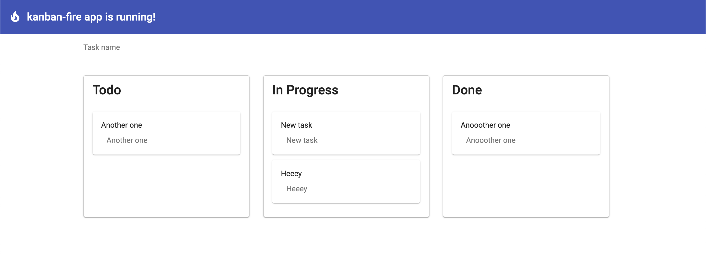

# 

<br/>
  
> Simple Angular app using Angular Material / DragAndDrop and Firebase


<br />

To run this application, you need to configure a firebase account and configure
your project. Then, configure your environment (<strong>environment.ts</strong>) firebase settings and finally, 
run the app:

```
npm i
ng s
```

Technologies used

- Angular
- Angular Material
- Angular Firestore
- Firebase
